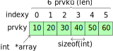
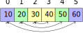
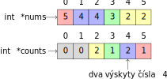
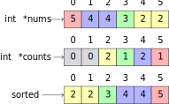
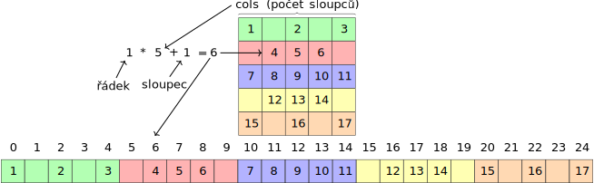

# Pole (Array)
Pole je složeno z více prvků stejného typu uspořádaných za sebou v paměti.
Pole je reprezentováno pointrem (`int *array`) neboli adresou na nultý prvek.
Počet prvků v poli si většinou musíme ukládat (`len`).




## `fill_array` - naplnění pole
```c
void fill_array(int *array, int len, int start, int increment);
```
Funkce naplní pole `array` čísly zvětšující se po `increment` a začínající od `start`.

Zavolání `fill_array(nums, 6, 10, 5)` naplní pole čísly: `10, 15, 20, 25, 30, 35`.

## `print_array` - vytisknutí pole
```c
void print_array(int *array, int len);
```
Vytvořte funkci, která pomocí cyklu `for` od `0` do `len` vytiskne jednotlivé prvky pole.
Ošetřete případ, kdy se do funkce předá nulová adresa `array`.

## `num_count` - počet výskytů čísla
```c
int num_count(int *array, int len, int num);
```
Funkce `num_count` projde celé pole a spočítá počet výskytu čísla `num`.

## `in_interval` - počet čísel v daném intervalu
```c
int in_interval(int *array, int len, int from, int to);
```
Oproti předchozí funkci se bude počítat počet čísel, která náleží do intervalu <from, to>.

## `avg` - průměrná hodnota pole
```c
double avg(int *array, int len);
```
Funkce spočítá součet všech prvků v poli a následně vrátí tento součet podělený počtem prvků, čímž získáme průměrnou hodnotu.
Při dělení nesmíme zapomenout na přetypování alespoň jednoho operandu na typ `double`, jinak by docházelo k celočíselnému dělení.


## `min_max` - minimální a maximální hodnota v poli
```c
void min_max(int *array, int len, int *min, int *max);
```
Ve funkci si nastavíme index minimální a maximální hodnoty na nultý prvek.
Parametr `min` je pointer, a je tedy nutné přistupovat k hodnotě pomoci dereference - `*min`, protože výraz `min` obsahuje jen adresu, kde je minimální index uložen.
Následně budeme procházet pole a pokud bude hodnota aktuálního prvku menší než hodnota prvku na dosud nalezeném indexu, nastavíme index na aktuální.

## `array_reverse` - převrácení pole
```c
void array_reverse(int *array, int len);
```
Pole projdeme pomoci cyklu do jeho půlky a budeme vždy prohazovat prvky z obou konců.
Pokud bychom projeli celé pole, tak bychom v druhé půlce přehazovali prvky na jejích původní místo.



Přehození dvou prvků nemůžeme udělat najednou, tak si musíme například prvek z levého konce uložit do proměnné a následně do toho prvku zapsat hodnotu z pravého konce.
Poté lze uložit hodnotu z proměnné do pravého konce.
Alternativně také můžeme využít funkci `void swap(int *a, int *b)` z příkladu [pointers](pointers.md).

## `dot` - skalární součin (dot product)
```c
int dot(int *a, int *b, int len);
```

## `counting_sort` - counting sort
Counting sort algoritmus je vhodný pro seřazení pole, které nabývá menšího rozsahu hodnot.
Pro každou možnou hodnotu pole si uchováváme čítač výskytů

```c
void counting_sort(int *array, int len, int from, int to);
```

V prvním kroku naplníme pole náhodnými čísly od 0 do 10.
Ve funkci `counting_sort` si vytvoříme pole 10 čítačů, které vynulujeme např. pomocí `for` cyklu.
Následně projdeme celé vstupní pole `array` a pro každý prvek inkrementujeme patřičný čítač.
Při výskytu prvku `0` inkrementujeme nultý čítač, při výskytu `1` první čítač atd.



Čítače jsou seřazený a obsahují počet výskytu jednotlivých čísel.
Stačí tedy projít všechny čítače a zapsat tolik prvků, kolik je hodnota daného čítače.



## `bubble_sort` - třídící algoritmus bubble sort
## `binary_search` - binární vyhledávání
## `array_copy`
## `array_clone`
## `array_insert`

# 2D pole
Matici/2D pole/obrázek můžeme reprezentovat v 1D poli tak, že řádky umístíme do paměti za sebe.
Index pro prvek v 1D poli můžeme spočítat jako `řádek * počet_sloupců + sloupec`.



## `print_matrix` - vytisknutí matice
```c
void print_matrix(int* matrix, int rows, int cols);
void print_img(int* matrix, int rows, int cols);
```
Funkce projde matici po řádcích a sloupcích a vypíše jednotlivé prvky.
V případě funkce `print_img` se vytisknou čísla jako znaky.

## `draw_star` - vykreslení hvězdice
```c
void draw_star(int* matrix, int rows, int cols);
```
Hvězdici můžeme vykreslit do pole pomocí jediného cyklu.

## `matrix_mul_scalar` - násobení matice skalárem
```c
void matrix_mul_scalar(int* matrix, int rows, int cols, int k);
```
Vytvořte funkci, která vynásobí každý prvek matice číslem `k`.


## `matrix_mul_vec` - násobení matice vektorem
```c
int* matrix_mul_vec(int* matrix, int rows, int cols, int *vec, int len);
```


## `matrix_mul` - násobení dvou matic

