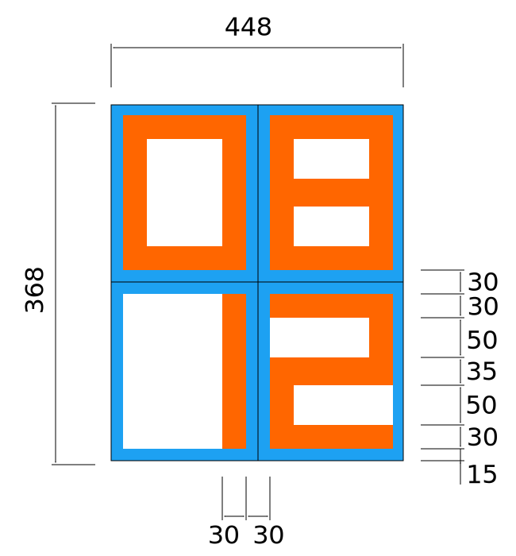

# Struktury pro zápis obrázku formátu TGA a jeho manipulaci

Pro tyto úlohy využijte stuktury na funkce pro zápis obrázku formátu TGA do souboru.

Vše má svůj příběh a tak tedy započněme naši cestu např. ve firmě [Apple](https://www.apple.com)...

## Apple Watch Developers :-)

Představte si, že jste vývojářem/kou ve firmě Apple a [Steve Jobs](https://en.wikipedia.org/wiki/Steve_Jobs) Vás pověří programátorským úkolem.

Firma aktuálně pracuje na super tajném projektu [nových smart hodinek](https://en.wikipedia.org/wiki/Apple_Watch), které chce uvést na trh.
Vašim úkolem je pod přímým vedením Steva Jobse (původního zakladatele firmy) naprogramovat digitální ciferník nových hodinek.

### Technické specifikace displeje

Displej hodinek má rozlišení `368x448` px ([pixelů](https://en.wikipedia.org/wiki/Pixel)).

### Schéma pro zobrazení znaků

Na obrázku výše je rozklesleno, jak by se měl zobrazovat čas na hodinkách.
První řádek slouží pro zobrazeni hodin, druhý řádek pro zobrazení minut.
Tloušťky jednotlivých segmentů a rozestupy jsou také zakresleny.
Modře je znázorněna oblast, kde se nic nevykresluje.
Jsou znázorněna jen čtyři čísla, zbytek si již odvodíte sami.

### Funkce na implementaci

Postupně naimplementujte následující funkce a struktury.

#### Funkce `watch_draw_time( TGAImage * self, const int hours, const int minutes )`

Funkce nakreslí do obrázku `self` čas zadaný pomocí času v hodinách (`hours`) a minutách (`minutes`).
Barvu čísel si zvolte libovolně, stějně jako barvu pozadí.

#### Struktura pro reprezentaci barvy pixelu (`BGRA`)

Barva se do každého pixelu zapisuje jako čtveřice bajtů `BGRA` (`B` - Blue, `G` - Green, `R` - Red, `A` - Alpha).
Nadefinujte si strukturu `RGBA`, která bude tyto bajty reprezentovat pomocí čtyř proměnných: `r`, `g`, `b`,`a` patřičného datového typu.

#### Funkce `watch_draw_time_color( TGAImage * self, const int hours, const int minutes, const BGRA * fg_color, const BGRA * bg_color )`

Funkce nakreslí do obrázku `self` čas zadaný pomocí času v hodinách (`hours`) a minutách (`minutes`).
Barva čísel je předána parametrem `fg_color`, barva pozadí pak parametrem `bg_color`.
